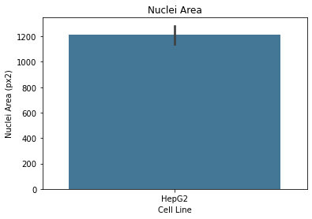

Nuclei-Segmentation: Using Cellpose to Segment Nuclei and Measure BrdU Incorporation


Project Background:  This example is using representative images from a figure in Q Wei, et al. "Design, Synthesis, and In Vitro and In Vivo Biological Studies of a 3′-Deoxythymidine Conjugate that Potentially Kills Cancer Cells Selectively." December 2012PLoS ONE 7(12):e52199. In this example, the authors measured the changes in proliferation in response to chemotherapuetics using BrdU incorporation. The goal is to identify and count the cells that are BrdU postiive from the nuclear staining and BrdU images.  

The figure we will be using for representative images is here: 


Start with everything you will need to import for this example.
```python
import matplotlib.pyplot as plt
import skimage.io
import pandas as pd
import seaborn as sns

from cellpose import models, io, plot
from os import listdir
from os.path import join
from skimage.measure import regionprops
from skimage.color import rgb2gray
```

Load images from the paper.  To get individual images, I cropped the HepG2 images and saved as 8-bit grayscale images.  

```python
#First, load in images.
#We have for this example: nuclear staining and BrdU staining
mypath = "BrdU Images/"

nuc_filenames = [x for x in listdir(mypath) if "nuc" in x]
brdu_filenames = [x for x in listdir(mypath) if "BrdU" in x]

imgs_nuc = [skimage.io.imread(join(mypath, x)) for x in nuc_filenames]
imgs_brdu = [skimage.io.imread(join(mypath, x)) for x in nuc_filenames]
```

I decided to use Cellpose for this example.  Cellpose is "a generalist algorith for cell segmentation" that uses machine learning to segment either nuclei or cell bodies from brightfield or flouresence images.  The HUGE advantage of using this library is that they have a great repository of training data. They also recently released Cellpose 2.0 that allows for an interactive adjustment of the training data.  The user interface they generated is also great for testing out the different models.  Extremely helpful tool that quickly allows us to find the nuclei.  https://www.cellpose.org/.

```python
#segment nuclei using Cellpose and Meausure BrdU intensity 
model = models.Cellpose(model_type = "nuclei")
chan = [[0,0]]

nuc_areas_all = []
brdu_intensity_all = []
cell_line_all = []
condition_all = []

for i in range(len(imgs_nuc)):
    img_nuc = imgs_nuc[i]
    img_brdu = imgs_brdu[i]
   
    #perform segmentation
    masks, flows, styles, diams = model.eval(img_nuc, diameter = 35.0, channels = chan)

    #measure nuclei area
    nuc_props = regionprops(masks)
    nuc_areas = [region.area for region in nuc_props]

    #now meausre the BrdU signal for each nucleus
    brdu_props = regionprops(masks, img_brdu)
    brdu_intensity = [region.mean_intensity for region in brdu_props]
    
    #save info from filenames
    cell_line = [nuc_filenames[i].split("_")[2] for x in nuc_areas] #make dimension match above measurements
    condition = [nuc_filenames[i].split("_")[1] for x in nuc_areas] #make dimension match above measurements

    #save results to "all" arrays
    nuc_areas_all = nuc_areas_all + nuc_areas
    brdu_intensity_all = brdu_intensity_all + brdu_intensity
    cell_line_all = cell_line_all + cell_line
    condition_all = condition_all + condition
    
    #Show results of segmentation.  
    fig = plt.figure(figsize=(12,5))
    plot.show_segmentation(fig, img_nuc, masks, flows[0], channels=chan)
    plt.tight_layout()
    plt.show()

#organize measurements into a dataframe
df = pd.DataFrame()
df["Cell Line"] = cell_line_all
df["Condition"] = condition_all
df["Nuclei Area (px2)"] = nuc_areas_all
df["BrdU Mean Intensity (AU)"] = brdu_intensity_all

#remove .tif ending from Cell Line column
df["Cell Line"] = df["Cell Line"].str.rstrip('.tif')
```
And here is an example of the output.  We see the time to perform the segmentaion, and we can look at the predicted outlines and flows.

    >>>> using CPU
    Running test snippet to check if MKL-DNN working
    see https://pytorch.org/docs/stable/backends.html?highlight=mkl
    ** MKL version working - CPU version is sped up. **
    processing 1 image(s)
    time spent: running network 16.90s; flow+mask computation 0.54
    estimated masks for 1 image(s) in 17.46 sec
    >>>> TOTAL TIME 17.46 sec


    

    
Although it's not particularly interesting for this example, I'm putting here a reminder that we can measure off of the masks.  Here I have plotted the area of the nuclei, and this kind of measuremnet (using regionprops) allows you to measure several parameters about the masks.  If there are features that are not outputs from regionprops, you can also add your own calculations using extra_properties.  


```python
#plot nuclei area measurements
hue_order = ["DMSO", "dT-QX10uM", "dT-QX50uM"]


ax = sns.barplot(data = df, x = "Cell Line", y = "Nuclei Area (px2)",
                 hue_order = hue_order, palette = "mako")
ax.set_title("Nuclei Area")

```


    Text(0.5, 1.0, 'Nuclei Area')


    

    

We also used the positions of the masks to measure the intensity of the corresponding BrdU image (using region props with the masks and intensity image).  As a first pass looking at the data, it's helpful to visualize all of the data.  We see that there is a distribution of average BrdU intensity in all of the conditions, but the intensity in the control is shifted higher than the two treatment groups. 

```python
#plot BrdU Intensity measurements
order = ["DMSO", "dT-QX10uM", "dT-QX50uM"]

ax = sns.swarmplot(data = df, x = "Condition", y = "BrdU Mean Intensity (AU)", hue = "Condition", 
                 order = order, palette = "mako", dodge = False)
ax.set_title("BrdU Intensity")
ax.get_legend().remove()
```


    

    

Finally, we can calculate the percent of nuceli in the field that are BrdU positive by using an intensity threshold value.  The BrdU assay works by pulsing the cells with a labeld nucleotide that is incorporated into cells that are in the process of dividing (S-phase).  The more the cells are synthesizing DNA with this labeled nucleotide, the brighter the signal will be.  Ideally we would have a control with no BrdU but did have all of the other stains (e.g. the nuclear stain in this case) so we could measure the background of the nuclear stain into the BrdU image.  But in this case, that image was not available so we made a guess at what a good threshold value should be.  Looking at the images, I decided to use a value of 80.  This arbitrary cutoff is not ideal, but is still a good exmaple of how to apply a threshold to data in this format.

```python
#Find the percent that are BrdU positive
#Threshold values should be determined using a control (e.g. cells you are sure are not entering S-phase)

df["BrdU Positive"] = [100 if i > 80 else 0 for i in df["BrdU Mean Intensity (AU)"]]

order = ["DMSO", "dT-QX10uM", "dT-QX50uM"]

ax = sns.barplot(data = df, x = "Condition", y = "BrdU Positive", hue = "Condition", 
                 order = order, palette = "mako", dodge = False)
ax.set_title("% BrdU Positive")
ax.get_legend().remove()
```


    

    

As we saw qualitatively, the measurements show that there are fewer cells in the process of dividing with the treatment than in the DMSO control.


